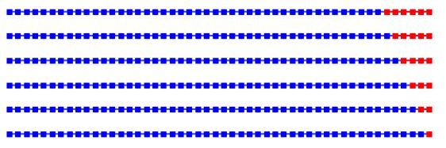

```{r setup, include=FALSE}
# install.packages("rmarkdown")
# install.packages("tsfknn")
# install.packages("ggplot2")
# install.packages("kableExtra")
# install.packages("tableHTML")
# install.packages("knitr")
# install.packages("dplyr")
# install.packages("fpp2")
# install.packages("prettydoc")
#install.packages("rmdformats")
library(rmdformats)
library(prettydoc)
library(dplyr)
library(fpp2)
library(kableExtra)
library(rmarkdown)
library(tsfknn)
library(ggplot2)
library(knitr)
library(tableHTML)

## Global options
options(max.print="75")
opts_chunk$set(echo=FALSE,
	             cache=TRUE,
               prompt=FALSE,
               tidy=TRUE,
               comment=NA,
               message=FALSE,
               warning=FALSE)
opts_knit$set(width=75)
options(repos="https://cran.rstudio.com")
options(encoding = 'UTF-8')
```

<style>
body {
text-align: justify}
</style>

# KNN(k Nearest Neighbours)

$~$$~$ Hem sınıflandırma hem de regresyon problemlerinin çözümünde kullanılıyor olmakla birlikte, endüstride çoğunlukla sınıflandırma problemlerinin çözümünde kullanılmaktadır.
KNN algoritmaları, 1967 yılında T. M. Cover ve P. E. Hart tarafından önerilmiştir. Algoritma, sınıfları belli olan bir örnek kümesindeki verilerden yararlanılarak kullanılmaktadır. Örnek veri setine katılacak olan yeni verinin, mevcut verilere göre uzaklığı hesaplanıp, k sayıda yakın komşuluğuna bakılır.

Uzaklık hesapları için genelde 3 tip uzaklık fonksiyonu kullanılmaktadır:

* Oklid uzaklığı

* Minkowski uzaklığı

* Manhattan uzaklığı


$~$$~$ Hepsi tek bir ana fonksiyondan türetilmektedir. Minkowski fonksiyonundaki q=1 değeri için manhattan uzaklığı; q=2 değeri için öklid uzaklık formulünü elde ediyoruz. Bu sebeple minkowski genel formulunu kullanarak uygulamamızı yapacağız. Böylece diğer uzaklık ölçümleri için sadece q değerini değiştirmemiz yeterlidir.
Öklid uzaklığı, 2 boyutlu uzayı ele aldığımızda,aslında pisagor teoreminin uygulanmasıdır. Q sayıda değişkene bağlı bir uzaklık hesaplamak isteniyorsa Minkowski yöntemi kullanılır. Formülde Q yerine 2 değerini verirsek aslında Öklid bağlantısını elde ettiğimizi görebiliriz.

$~$$~$ K-NN ( K-Nearest Neighbor) algoritması en çok kullanılan sınıflandırma algoritmasından biridir. K-NN non-parametric (parametrik olmayan), lazy (tembel) bir öğrenme algoritmasıdır. lazy kavramını anlamaya çalışırsak eager(istekli) learning aksine lazy learning’in bir eğitim aşaması yoktur. Eğitim verilerini öğrenmez, bunun yerine eğitim veri kümesini “ezberler”. Bir tahmin yapmak istediğimizde, tüm veri setinde en yakın komşuları arar.

```{r echo=FALSE, message=FALSE, warning=FALSE}
knnAdimlar <- data.frame(
  Adımlar = c("1. Adım", "2. Adım", "3. Adım", "4. Adım", "5. Adım"),
  KNN_Algoritmasının_Adımları = c(
    "Sınıf nitelikleri belli olan elemanlardan oluşan bir uzaya yeni bir örnek ekle. ",
    "K sayısını belirle. ", 
    "Yeni gelen örnek ile elemanlar arasındaki uzaklığı hesapla.(Uzaklık fonksiyonlardan birini kullanarak) ",
    "En yakın olan k tane elemanın sınıf niteliğine bak. ",
    "En yakın olan k tane elemanlardan sınıf değeri sayıca fazla olan sınıfa örneği dahil et. "
  )
)

kbl(knnAdimlar) %>%
  kable_paper(full_width = F) %>%
  column_spec(1, bold = T, border_right = T) %>%
  column_spec(2, width = "50em", background = "yellow")
```

$~$$~$ KNN en basit anlamı ile içerisinde tahmin edilecek değerin bağımsız değişkenlerinin oluşturduğu vektörün en yakın komşularının hangi sınıfta yoğun olduğu bilgisi üzerinden sınıfını tahmin etmeye dayanır.


$~$$~$ Makine öğrenmesi ile çözülebilen problemlerden biri çok geniş kullanım alanı ile sınıflandırma problemleridir. Günümüzdeki bir çok problem bir şekilde sınıflandırma problemi olarak tasarlanıp çözülebilmektdir. 
   
- KNN algoritması küçük bir örnek:

```{r message=FALSE, warning=FALSE, include=FALSE}
data <- data.frame(Boy_Verisi = c(180,170,150,160,175,185,173,183,153,163),
                   Kilo_Verisi = c(80,70,65,55,65,90,100,110,60,45),
                   Cinsiyet = c("Erkek","Erkek","Kadın","Kadın","Kadın","Erkek","Erkek","Erkek","Kadın","Kadın"))
```

```{r echo=FALSE, message=FALSE, warning=FALSE}
data %>%
  kbl() %>%
  kable_paper("hover", full_width = F)
```

```{r echo=TRUE, message=FALSE, warning=FALSE}

KNN_Cinsiyet<-function(dataSet,boy,kilo,k){
  euclid <- c()
  for (i in 1:nrow(dataSet)){
    euclid <- append(euclid,sqrt(sum((dataSet[i,1:2]-c(boy,kilo)) ^ 2)))
  }
  enYakinKData <- as.data.frame(euclid)
  enYakinKData <- data.frame(Satir_No=row(enYakinKData),Oklid_Mesafeleri=euclid)
  enYakinKDataOrder <- enYakinKData[order(enYakinKData$Oklid_Mesafeleri),]
  enYakinKDataOrder2 <- cbind(enYakinKDataOrder,Cinsiyet=data[enYakinKDataOrder$Satir_No,3])
  countx<-count(enYakinKDataOrder2[1:k,],Cinsiyet)
  if (nrow(countx) == 1){
    sonuc <- countx[1,]$Cinsiyet
  } else if (countx[1,]$n > countx[2,]$n) {
    sonuc <- countx[1,]$Cinsiyet
  } else if(countx[1,]$n == countx[2,]$n){
    sonuc <- "En yakın komşu sayısı eşit çıkmıştır."
  } else {
    sonuc <- countx[2,]$Cinsiyet
  }
  return(sonuc)
}

```

```{r echo=TRUE, message=FALSE, warning=FALSE}
KNN_Cinsiyet(data,160,70,3)
```

**KNN ne zaman kullanlır ?**

$~$$~$ Algoritma, veri araştırmacısının benzer belgeler için semantik olarak aradığı konsept araştırmasında kullanılır. Keşfetmek, algoritmanın verilen soruyla ilgili tüm e-postaları, kısa özetleri, sözleşmeleri, vb. bulmak için kullanılabileceği başka bir kullanım senaryosudur. Tavsiye sistemlerinde genellikle bir müşterinin belirli bir öğeyi beğendiğini biliyorsanız, KNN’yi entegre eder, daha sonra bunlara benzer öğeler önerebilirsiniz. Son olarak, k-NN, Yapay Sinir Ağları (ANN) ve Destek Vektör Makineleri (SVM) gibi daha karmaşık sınıflandırıcılar için bir ölçüt olarak sıklıkla kullanılır.
   
$~$$~$ Aşağıdaki problemler sınıflandırma problemlerine örnek olarak verilebilir:

* Müşterinin verilen krediyi ödeyip ödeyemeyeceği (Customer Default Risk)

* Müşterinin aldığı servisi bırakıp bırakmayacağı (Customer Churn)

* Müşteri segmantasyon (Customer Segmantation)

* Kişiye özel ilaç tespiti

* E-posta spam filitrelemesi

* Görüntü tanıma (Image Recognition)

* El yazısı tanıma (Handwriting Recognition)

* Biyometrik tanımlama (Biometric Identification)


# Zaman Serisi Nedir?

$~$$~$ Bir zaman serisi, ilgilenilen bir büyüklüğün zaman içerisinde sıralanmış ölçümlerinin bir kümesidir. Zaman serisi ile ilgili bu analizin yapılma amacı ise, gözlem kümesince temsil edilen gerçeğin anlaşılması ve zaman serisindeki değişkenlerin gelecekteki değerlerinin doğru bir şekilde tahmin (forecast) edilmesidir . 

* Zaman serisi analizi; zaman içerisinde gelişen olayların ve işlemlerin analiz edilmesi ve iç görüye dönüştürülmesi ile tarihsel etkileri anlamak için önemli bir tekniktir.

* Zaman etkisiyle değişen olaylardan elde edilecek çıkarımlar ve bu etkilenmelerin işaretlenmesi, nedensellik ve anlam ilişkisi kurmak için oldukça faydalıdır.

* Zaman serileri; zamana göre (kronolojik) sıralanan veri dizileridir, veri satırları periyodik (saat, gün, ay, yıl vb.) bir döngü ile sıralanırlar.

* Zaman serileri sayısal olarak ifade edilebilecek olayların ve işlemlerin bir zaman damgası ile ilişkilendirildiği basit veri setleri olarak da tanımlanabilir.

* Zaman boyutları (Time) ardışık bir halde gözlemler (Observation) ile yan yana geldiklerinde zaman dizilerini oluşturmaktadır.

* Zaman serilerinin bir tarih aralığına (sınırlılık) sahip olması, onların tarih üzerinde bir örneklem olduğunu varsaymamızı gerektirir.

***“Bir zaman serisi, zaman içinden alınan ardışık bir dizi gözlemdir.”***

Örneğin;

$~$$~$ Bir insanın gün içerisinde attığı adım sayısı bir zaman serisi örneğidir, günler ile işaretlenecek olan adım sayıları, günler ile birlikte bir zaman serisi oluşturmaktadır.

Bu örnekte gün serinin zaman boyutudur, adım sayısı ise gözlemdir.

```{r echo=FALSE, message=FALSE, warning=FALSE}

adim <- data.frame(Günler_Zaman = c("21-01-2020","22-01-2020","23-01-2020","24-01-2020","25-01-2020"),
                 Adım_Sayısı_Gözlem = c("2236","1652","1725","2699","2756")
                 )

adim %>%
  kbl(caption = "Bir insanın gün içerisinde attığı adım sayısı") %>%
  kable_classic(full_width = T, html_font = "Cambria")

```

* Bir başka örnek;

$~$$~$ Bir işletmenin aylık satış verilerinin zaman damgası ile işaretli olduğu ve zaman üzerinde sıralanmış olduğu bir veri seti; zaman serisi verisidir, bu veri setinde zaman boyutu aylar, gözlemler ise satışlarla temsil edilmiş olur.

```{r echo=FALSE, message=FALSE, warning=FALSE}

satis <- data.frame(Ay_Zaman = c("Ocak","Şubat","Mart","Nisan","Mayıs"),
                 Satışlar_Gözlem = c("210.010 TL","230.883 TL","210.603 TL","260.218 TL","280.368 TL")
                 )
satis %>%
  kbl(caption = "Bir işletmenin aylık satış verileri") %>%
  kable_classic(full_width = T, html_font = "Cambria")
  
```

* Zaman serileri dört bileşenden oluşur; 

1. Trend(Genel Eğilim) bileşeni; Zaman serilerinin uzun sürede gösterdiği düşme ve yükselme süreçlerinden sonra oluşan kararlı durumdur. Zaman serileri uzun dönem açısından kararlı alçalma ya da yükselme şeklinde bir eğilime sahiptir.

2. Mevsim Bileşeni; Zaman serilerinde mevsimlere göre değişmeyi ifade eder.Zaman serileri açısından kullanılan verilerin kimi dönemleri diğer dönemlere göre farklılık gösterir.

3. Çevrimsel Bileşen(Konjonktürel); Ekonomide, mevsimsel değişmeler ile ilgili olmayan dönemsel değişmelerdir.Örneğin,ekonomide genel eğilimden bağımsız kısa süreli genişleme ya da daralma durumu çevrimsel süreci tarif eder.

4. Düzensiz Bileşen(Rassal); Diğer unsurlar gibi belirli olmayan, hata terimi ile ifade edilebilecek değişmelerdir. 

$~$$~$ Zaman serileri analizlerinde kullanılan bazı grafikler:

**time series plot**

```{r}
data = ts(nottem, start=1922, frequency=20)
plot(data, ylab = "Trend", xlab = "Yıllar")
```

**Mevsimsel Çizelge (Seasonal Plot)**

$~$$~$ Seasonal plot; farklı yıllardaki zaman serilerini üst üste görselleştirerek, her bir yılın sezonsal farklılığını ve ortak yanlarını anlamamıza yardımcı olan veri görselleştirme aracıdır.

```{r}
mimoTimeS <- window(UKDriverDeaths,end=c(1971,12))
ggseasonplot(mimoTimeS, year.labels=TRUE, year.labels.left=TRUE) +
ylab("Ölüm sayıları") +
xlab("Ay") +
ggtitle("Büyük Britanya'da ölen araç sürücülerinin aylık toplamı")

```

$~$$~$ Seasonal plot üzerinde mevsimsel farklılıkları polarizasyon ile incelemek istersek, farklı bir yöntem olan polar (kutupsal) görselleştirme varyasyonunu da kullanabiliriz. Kodlar üzerinde yapacağımız polar = TRUE düzenlemesi, zaman serisinin eksenini aşağıda gösterildiği gibi yatay yerine dairesel yapar.

**Polar Seasonal Plot**

```{r}
ggseasonplot(USAccDeaths, polar=TRUE) +
ylab("Ölüm Sayıları") +
xlab("Ay") +
ggtitle("ABD'deki kaza sonucu ölümlerin aylık toplamı")
```

# R programında KNN ile Zaman Serisi Tahmini: tsfknn Paketi

$~$$~$ KNN, sınıflandırma ve regresyonda kullanılan çok popüler bir algoritmadır. Bu algoritma, bir örnek koleksiyonunu saklar. Regresyonda, her örnek, örneği açıklayan bir özellik vektöründen ve onun ilişkili sayısal hedef değerinden oluşur. Yeni bir örnek verildiğinde, KNN, Öklid mesafesi gibi bir uzaklık ölçüsüne göre en yakın komşular olarak adlandırılan k en benzer örneğini bulur ve değerini en yakın komşularıyla ilişkili hedef değerlerin bir toplamı olarak tahmin eder.

$~$$~$ i. eğitim örneği, n özellikli bir vektör : $f^{i}_{1},f^{i}_{2},f^{i}_{3},...,f^{i}_{n}$,  ve  örneği açıklayan ve onunla ilişkili m öznitelikli hedef vektörü $t^{i}_{1},t^{i}_{2},t^{i}_{3},...,t^{i}_{n}$. vektöründen oluşur. Özellikleri bilinen ancak hedefi bilinmeyen yeni bir örnek verildiğinde, yeni örneğin özellikleri, özelliklerin vektörlerine ve bir benzerlik veya uzaklık ölçüsüne göre "k"  en benzer eğitim örneklerini bulmak için kullanılır. Örneğin, benzerlik metriğinin Öklid mesafesi olduğunu varsayarsak, yeni örnek ile i. eğitim örneği arasındaki mesafe aşağıdaki gibi hesaplanır:

$$ Öklid=\sqrt{\sum_{x=1}^n (e_x^i-q_x)^2}$$

$~$$~$ Yeni verilen örneğe en yakın olan “k” eğitim örnekleri, k en yakın komşuları olarak kabul edilir. Yeni bir örnek verildiğinde, en yakın komşularının hedeflerinin muhtemelen bilinmeyen hedefle benzer olduğu düşünülmektedir. Bu şekilde, en yakın komşuların hedefleri, yeni örneğin hedefini tahmin etmek için toplanır. Örneğin, hedefler veya k en yakın komşu vektörü olduğunu varsayarsak:  " yeni örneğin hedefini şu şekilde tahmin etmek için ortalamaları alınabilir: 

$$\sum_{i=1}^k \frac{t^i}{k}$$

$~$$~$ Kısacası, KNN n özellik tarafından tanımlanan eğitim örneklerinin bir koleksiyonunu depolar. Her eğitim örneği, n boyutlu bir uzaydaki bir noktayı temsil eder. Yeni bir örnek verildiğinde, KNN,  mevcut hedeflerinin bilinmeyen hedefe benzer olması umuduyla n boyutlu uzayda k en yakın örneklerini bulur.
Bir eğitim örneğiyle ilişkili hedef değeri, zaman serilerinin değerlerinin bir koleksiyonudur ve örneği açıklayan özellikler, hedefin gecikmeli değerleridir. Bir eğitim örneğinin hedefi zaman serisinin bir değeri olduğundan yalnızca bir değer tahmin edilecektir.

$~$$~$ Ayrıca, bir hedefi tanımlayan özelliklerin, onun zaman serisindeki ilk on iki gecikmeli değeri olduğuna karar verdiğimizi varsayalım. t zaman serisi ile ilişkili eğitim örnekleri veya örnekler Tablo 1'de gösterilmektedir. Özellik vektörü olarak 1'den 12'ye kadar gecikmeleri kullandığımız için, bir sonraki gelecek noktayla ilişkili özellik vektörü, zaman serisinin son on iki değerinden oluşan vektördür (x121, x122, ..., x132). 
   
$~$$~$ Örneğin, k 2'ye eşitse, yeni örneğin en yakın 2 komşuları bulunur ve hedefleri gelecek ayı tahmin etmek için toplanır. Zaman serisi tahmini için KNN kullanımının arkasındaki mantık, bir zaman serisinin tekrarlayan modeller içerebilmesidir. Bir zaman serisinin son modeli göz önüne alındığında, sonraki modellerinin zaman serisinin gelecekteki değerlerine benzer olacağı ümidiyle geçmişte benzer kalıplar ararız.

$~$$~$ Knn_examples ile eğitim örneklerine  başvurmadan önce, modeli oluşturmak gerekir. Bu, bir zaman serisiyle ilişkili bir model oluşturan ve modeli zaman serisinin gelecekteki değerlerini tahmin etmek için kullanan knn_forecasting  fonksiyonu ile yapılır. 
knn_forecasting çok kullanışlıdır çünkü yukarıda açıklandığı gibi KNN modelini oluşturur ve daha sonra modeli zaman serilerini tahmin etmek için kullanır. Bu fonksiyon, model bilgisi ve tahmini ile bir "knnForecast" nesnesi döndürür. Yukarıda gördüğümüz gibi, modelle ilgili eğitim örneklerini görmek için knn_examples fonksiyonunu kullanabilirsiniz. Ayrıca, tahmine başvurabilir veya "knnForecast" nesnesi aracılığıyla bunun grafiğini plot fonksiyonu ile çizdirebiliriz.

* Örneklere başlamadan önce paket içerisinde yer alan fonksiyonları ve argümanlarını incelersek:

## Tsfknn paketindeki fonksiyonlar ve yöntemler

```{r echo=FALSE, message=FALSE, warning=FALSE}
paketFonksiyon <- data.frame(
  Fonksiyon_Argüman = c("knn_forecasting", "timeS", "h", "lags", "k", "msas", "cf", "knn_examples", "near_neighbors", "plot ve autoplot","rolling_origin", "Print and summary", "predict", "n_training_examples"),
  Açıklamalar = c(
    "Bir zaman serisi ve bazı metaparametreler verildiğinde, bu işlev zaman serilerini tahmin etmek için bir KNN modeli oluşturur. Ayrıca bu modeli, zaman serilerinin gelecekteki değerlerine ilişkin bir tahmin yapmak için kullanır. Model ve tahmin hakkındaki bilgiler bir 'knnForecast' nesnesinde döndürülür. ",
    "Sayısal bir vektör veya ts sınıfının zaman serisidir.",
    "Pozitif bir tam sayı. Tahmin edilecek değerlerin sayısıdır.",
    "Otoregresif değişkenler olarak kullanılan gecikmeleri ifade eden artan sırada bir tamsayı vektörüdür. Gecikmeli değerler, özellikler veya açıklayıcı değişkenler olarak kullanılır.",
    "Pozitif bir tam sayıdır. KNN regresyonunda en yakın kaç komşuya bakılacağını ifade etmek için kullanılır. Bir k değerleri vektörü de kullanılabilir. Bu durumda, tahmin, farklı k parametreleri ile farklı modeller tarafından üretilen tahminlerin ortalamasıdır.",
    "Çok adımlı ileriye dönük strateji yöntemini belirtmek için kullanılır. 'Özyinelemeli' veya 'MIMO' (varsayılan) olabilir.",
    "n yakın komşularla ilişkili hedefleri birleştirmek için kullanılan kombinasyon fonksiyonu gösterir. 'Medyan', 'ağırlıklı' veya 'ortalama' (varsayılan) olabilir.",
    "Bir KNN modeliyle ilişkili örnekleri gösterir.",
    "Bir tahminde ve en yakın komşularında kullanılan yeni örneği gösterir. Tahminin nasıl yapıldığını görmek de mümkündür. Yani, hedefi tahmin edilen yeni örneğe ve en yakın komşularına bakabilmemizi sağlar. Bu bilgi, bir 'knnForecast' nesnesine uygulanmış 'nearest_neighbors' fonksiyonu ile elde edilir.",
    "Bir zaman serisini ve tahminini çizer.",
    "Bir KNN modelinin tahmin doğruluğunu değerlendirir.",
    "Bir model ve tahmini hakkındaki bilgileri gösterir.",
    "Belirli bir KNN modeli için yeni tahminler üretir.",
    "Belirli bir zaman serisi ve bazı metaparametreler için bir KNN modelinin sahip olacağı örneklerin sayısını gösterir."
  )
)

kbl(paketFonksiyon) %>%
  kable_paper(full_width = F) %>%
  column_spec(1, bold = T, border_right = T) %>%
  column_spec(2, width = "60em", background = "yellow")
```
<br>
```{r echo=FALSE, message=FALSE, warning=FALSE}
df <- data.frame(Features = c("$X_{1}$,$X_{2}$,$X_{3}$,$X_{4}$,$X_{5}$,$X_{6}$,$X_{7}$,$X_{8}$,$X_{9}$,$X_{10}$,$X_{11}$,$X_{12}$","$X_{2}$,$X_{3}$,$X_{4}$,$X_{5}$,$X_{6}$,$X_{7}$,$X_{8}$,$X_{9}$,$X_{10}$,$X_{11}$,$X_{12}$,$X_{13}$","$X_{3}$,$X_{4}$,$X_{5}$,$X_{6}$,$X_{7}$,$X_{8}$,$X_{9}$,$X_{10}$,$X_{11}$,$X_{12}$,$X_{13}$,$X_{14}$","...","$X_{120}$,$X_{121}$,$X_{122}$,$X_{123}$,$X_{124}$,$X_{125}$,$X_{126}$,$X_{127}$,$X_{128}$,$X_{129}$,$X_{130}$,$X_{131}$"),
                 Target = c("$X_{13}$","$X_{14}$","$X_{15}$","...","$X_{132}$"
                          ))
kbl(df) %>%
  kable_paper(bootstrap_options = "striped",full_width = T) %>%
  footnote(general = "t zaman serisi ile ilişkili eğitim örnekleri",
           general_title = "Tablo 1: ",
           alphabet_title = "Type II: ", symbol_title = "Type III: ",
           footnote_as_chunk = T, title_format = c("italic", "underline"))
```
<br>
**tsfknn paketinin bir zaman serisini tahmin etmek için nasıl kullanılmaktadır ?**

```{r}
nottem
```

$~$$~$ **nottem** veri seti, Nottingham Kalesi'nde 20 yıl boyunca Fahrenheit derece cinsinden ortalama hava sıcaklıklarını içeren bir zaman serisi nesnesidir.

```{r}
class(nottem)
```

$~$$~$ Bu veri setinin classına baktığımızda "ts" olduğunu görüyoruz. "ts" fonksiyonu, zaman serisi nesneleri oluşturmak için kullanılmaktadır.

$~$$~$ Örneğimizi daha iyi açıklayabilmek için veri setinde ilk 3 yılı ele alıp 1923 yılının ilk ayını tahmin etmeye çalışacağız. Bu yüzden **window** fonksiyonu ile veri setimizde kaç yılına kadar almak istiyorsak argüman olarak belirtip **timeS** değişkinene atama işlemini gerçekleştirdik. Ardından **knn_forecasting** fonksiyonu ile  zaman serilerini tahmin etmek için bir KNN modeli oluşturduk ve bu zaman serilerinin gelecekteki değerlerine ilişkin bir tahmin yapmak için kullanmış olduk. Bu fonksiyon ile model ve tahmin hakkındaki bilgiler bir "knnForecast" nesnesinde döndürülür ve bu nesneyi **pred** adında oluşturduğmuz değişkene atama işlemini gerçekleştirdik. **knn_forecasting** fonksiyonuna veri setimizi, tahmin sayımızı(**h=1**), en yakın komşu olarak bakmasını istediğimiz sayıyı(**k=2**) ve gecikmeleri yani özelliklerimizi yılın ayları şeklinde tahminleyeceğimiz için 1:12 olarak yazdık.  **knn_examples** fonksiyonuna pred değişkenini argüman olarak vererek bir KNN modeliyle ilişkili örnekleri görebilmiş olduk. 

```{r}
timeS <- window(nottem,end=c(1922,12))
timeS
pred <- knn_forecasting(timeS,h=1,lags=1:12,k=2)
knn_examples(pred)
```

$~$$~$ Knn_examples ile eğitim örneklerine  başvurmadan önce, modeli oluşturmamız gerektiğinden bahsetmiştik. Bu, bir zaman serisiyle ilişkili bir model oluşturan ve modeli zaman serisinin gelecekteki değerlerini tahmin etmek için kullanan knn_forecasting  fonksiyonu ile yapabilmekteyiz.

**Peki nasıl çalışır ?**


```{r}

# Kayan pencere algoritmasını kullanır:

knn_ExamplesData<-function(dataTs,lagG=12,Tsay=1){
                    features <- c()
                    targets <- c()
                    colLogs <- c()
                    colTarg <- c()
                    m <- lagG
                    for ( i in 1:length(dataTs)) {
                      
                      features <- append(features,dataTs[i:m])
                      targets <- append(targets,dataTs[(m+1):(m+Tsay)])
                      m = m + 1
                      if (m == (length(dataTs)+1-Tsay)){
                        break
                      }
                    }
                    
                    features <- t(matrix(features,nrow = lagG))
                    targets <- t(matrix(targets,nrow = Tsay))
                    knn_ExamplesSonuc<-cbind(features,targets)
                    for (i in (lagG):1){
                      colLogs <- append(colLogs,paste("Lag",i,sep = ""))
                    }
                    for (j in 1:Tsay){
                      colTarg <- append(colTarg,paste("H",j,sep = ""))
                    }
                
                    colnames(knn_ExamplesSonuc) <- c(colLogs,colTarg)
                    
                    return(knn_ExamplesSonuc)
}
knn_ExamplesData(timeS,lagG=12,Tsay = 1)

```

$~$$~$ Zaman serisi veri setindeki ilk yılın 12 ayını özellik vektörü olarak ilk hedef değerini ise 2. yılın ilk ayı olarak ele alır. 2. özellik vektörümüz ise ilk özellik vektöründeki ilk yılın ilk ayından hemen sonraki 12 ayı özellik vektörü olarak ve hedef değerini ise 3. yılın ilk ayı olarak ele alarak devam eder. Son hedef değerimiz ise veri setimizin son ayı ve özellik vektörümüz ise son ayımızından hemen önceki ilk 12 aydır. 

$~$$~$ Özellik olarak gecikmeleri 1: 12'yi kullandığımız için, zaman serisinin bir sonraki gelecek değerin (1923 yılının Ocak ayı) özellik vektörü, zaman serisinin son on iki değeridir.

$~$$~$ Tahminin nasıl yapıldığını görebiliriz. Yani, hedefi tahmin edilen yeni örneğe ve en yakın komşularına bakabiliriz. Bu bilgi, bir "knnForecast" nesnesine uygulanmış “nearest_neighbors” fonksiyonu ile elde edilir:

```{r}
nearest_neighbors(pred)
```
* **nearest_neighbors** fonksiyonu bize tahmin etmeye çalıştığımız hedefin yeni örneği veya özellik vektörünü ve bu özellik vektörüne en yakın olan 2 komşusunun özellik ve hedef vektörünü verir. 

$~$$~$ **En yakın iki komşu ise şu şekilde belirlenir:**

* **knn_examples(pred)** ile veri setimizdeki veri sayısı ile gecikme değerlerimizin farkı kadar satır elde ederiz. Yani 1923 yılına kadar verilerimizi aldık ve 1923 yılının ilk ayını tahmin etmeye çalıştığımız için bize ilk 3 yıldan 36 tane sıcaklık değeri gelir. Bu durumda 24 tane gecikme değerleri ve hedef değei olan satır elde ederiz.

* knn_examples(pred) ile elde ettiğimiz gecikmeleri ve hedefleri bir matrise dönüştürerek en yakın 2 komşuyu kendimiz bulmak istersek:

```{r}

ornekler <- knn_examples(pred)
nn_instance <- nearest_neighbors(pred)
euclidean <- c()
for (i in 1:nrow(ornekler)) {
  euclidean <- append(euclidean,sqrt(sum((ornekler[i,1:12] - nn_instance$instance) ^ 2)))
}

enYakin2 <- as.data.frame(euclidean)
enYakin2 <- data.frame(Satir_No=row(enYakin2),Oklid_Mesafeleri=euclidean)
order(enYakin2$Oklid_Mesafeleri)

```

$~$$~$ Kendimiz elde etmek istediğimizde de öklid mesafelerine bakarak en yakın 2 komşunun, knn_examples(pred) sonucundaki 1. ve 2. satır olduğunu teyit etmiş olduk.

```{r}
pred$prediction
```

$~$$~$ 1923 yılının ilk ayının tahmin değeri 42 Fahrenheit olarak bulunmuştur. Bu değer, tahmin etmeye çalıştığımız hedefin özellik vektörüne en yakın olan 2 komşusunun hedef değerlerinin ortalamasıdır.

```{r}
plot(pred)
```

$~$$~$ **knnForecast** nesnesi aracılığıyla bunun grafiğini çizdirebileceğimizden bahsetmiştik. Grafiğimizi çizdirdiğimizde; y ekseninde Fahrenheit değerleri ve x ekseninde yıllarımız yer almaktadır. Tahmin edilen değerimiz kırmızı nokta ile grafikte belirtilmiştir.

$~$$~$ Yeni örneği, en yakın komşularını ve tahmini içeren olay örgüsü aşağıdaki grafik ile de görselleştirilebilir:
(Bu grafik için "ggplot2" kütüphanesine ihtiyaç vardır.)

```{r}
autoplot(pred, highlight = "neighbors",faceting=F)
```

$~$$~$ Bu grafik bize 4 farklı sembol ile görsellik sağlar. 

* Bu semboller:

1. Forecast: Tahmin edilen değeri gösterir.

2. Instance: Tahmin etmeye çalıştığımız hedefin özellik vektörüne ait değerleri gösterir. 

3. NN Targets: En yakın k komşudaki hedef değerleri gösterir.

4. NN Features: En yakın k komşudaki özellik vektörüne ait değerleri gösterir. 

## Çok Adımlı İleriye Dönük Stratejiler

$~$$~$ Bir önceki bölümde, KNN ile bir adım ileri tahmin için örnek yapmıştık. Aynı zamanda, gelecekte birden fazla değeri tahmin etmekte çok yaygın bir kullanımdadır. Bu amaçla, çok adımlı bir ileri strateji seçilerek çoklu tahmin yapılabilir. Bu pakette iki ortak strateji vardır: 

1. MIMO—Çoklu Girdi Çoklu Çıktı Stratejisi

2. Özyinelemeli Strateji 

* Yalnızca bir gelecek değeri tahmin edildiğinde her iki stratejide aynı çalışma mantığını göstermektedir. 

### MIMO Stratejisi - Multiple-Input and Multiple-Output

$~$$~$ Çoklu Girdi Çoklu Çıktı stratejisi yaygın olarak KNN ile uygulanır ve hedef değerlerin bir vektörünün kullanılması ile karakterize edilir. Bu vektörün uzunluğu tahmin edilecek periyotların sayısına eşittir. Örneğin, Büyük Britanya'da aylık ölen toplam otomobil sürücülerini veren bir zaman serisiyle çalıştığımızı varsayalım ve önümüzdeki 12 ay için ölenlerin sayısını tahmin etmek istiyoruz. Bu durumda, özellik olarak kullanılan gecikmeler için iyi bir seçim 1:12 olacaktır.

$~$$~$ Eğer MIMO stratejisi seçilirse, bir eğitim örneği şunlardan oluşur:

• 12 ay ardışık ölüm sayılarına sahip bir hedef vektör ve

• Ardışık önceki 12 aydaki ölümlerin sayısını gösteren bir özellik vektörü--hedef vektörün 12 ayından hemen önce.

$~$$~$ Yeni örnek(instance), zaman serisinin son 12 ayında ölen araba sürücülerinin sayısı olacaktır. Bu şekilde, zaman serilerinde son 12 aya en çok benzeyen ölüm sayısını ararız ve sonraki 12 ayı tahmin ederiz. 

* Aşağıdaki örnekte, MIMO stratejisini kullanarak önümüzdeki 12 ayı tahmin etmeye çalışacağız:

```{r}
UKDriverDeaths
```

$~$$~$ **UKDriverDeaths** veri seti; Ocak 1969 ile Aralık 1984 arasında Büyük Britanya'da ölen veya ciddi şekilde yaralanan araç sürücülerinin aylık toplamını veren bir zaman serisidir.

$~$$~$ Örneğimizi daha iyi açıklayabilmek için veri setinde ilk 3 yılı ele alıp 1972 yılındaki ölen veya ciddi şekilde yaralanan araç sürücülerinin aylık toplamını tahmin etmeye çalışacağız. 

$~$$~$ knn_forecasting fonksiyonun **msas** argümanına **"MIMO"** yazarak çoklu girdi çoklu çıktı stratejisini uygulayabiliriz.

```{r}
mimoTimeS <- window(UKDriverDeaths,end=c(1971,12))
mimoPred <- knn_forecasting(mimoTimeS, h= 12, lags = 1:12, k=2, msas = "MIMO")
knn_examples(mimoPred)
mimoTimeS
```

$~$$~$ **Peki nasıl çalışır ?**

* İlk özellik vektörü zaman serisindeki ilk yılın 12 ayıdır.
* İlk hedef vektörü ise zaman serisindeki ikinci yılın 12 ayıdır.
* İkinci özellik vektörü, zaman serisindeki ilk yılın ilk ayından hemen sonraki 12 aydır.
* İkinci hedef vektörü ise zaman serisindeki ikinci yılın ilk ayından hemen sonraki 12 aydır.
* Üçüncü özellik vektörü, zaman serisindeki ilk yılın ikinci ayından hemen sonraki 12 aydır.
* Üçüncü hedef vektörü ise, zaman serisindeki ikinci yılın ikinci ayından hemen soraki 12 aydır.
* ...
* n. özellik vektörü, zaman serisindeki sondan bir önceki yılın 12 ayıdır.
* n. hedef vektörü ise zaman serisindeki son yılın 12 ayıdır.

$~$$~$ Özellik olarak gecikmeleri 1: 12'yi kullandığımız için, zaman serisinin bir sonraki gelecek değerlerin (1972 yılının 12 ayı) özellik vektörü, zaman serisinin son 12 ayıdır.

$~$$~$ nearest_neighbors fonksiyonu ile hedefi tahmin edilen yeni örneğe ve en yakın komşularıa bakalım:

```{r}
nearest_neighbors(mimoPred)
```

* **nearest_neighbors** fonksiyonu bize tahmin etmeye çalıştığımız hedefin yeni örneği veya özellik vektörünü ve bu özellik vektörüne en yakın olan 2 komşusunun özellik ve hedef vektörünü verir. 

$~$$~$ **En yakın iki komşu ise şu şekilde belirlenir:**

* Bir hedef vektöründe tahmin etmeye çalıştığımız 12 ay olduğu için ve veri setindeki son 12 ay bizim bir sonraki yılın 12 ayını tahmin etmek için kullandığımız özellik vektörü olmasından dolayı algoritma veri setindeki son 12 aya kadar devam eder. Bu durumda 2. yılın ilk ayından itibaren 12 li periodlar halinde seçtiğimizde 13 tane özellik vektörü ve bu özellik vektörlerinin hedef vektörlerini elde ederiz.

$~$$~$ knn_examples(pred) ile elde ettiğimiz gecikmeleri ve hedefleri bir matrise dönüştürerek en yakın 2 komşuyu kendimiz bulmak istersek:

```{r}
mimoOrnekler <- knn_examples(mimoPred)
mimoNN_instance <- nearest_neighbors(mimoPred)
mimoEuclidean <- c()
for (i in 1:nrow(mimoOrnekler)) {
  mimoEuclidean <- append(mimoEuclidean,sqrt(sum((mimoOrnekler[i,1:12] - mimoNN_instance$instance) ^ 2)))
}
mimoEnYakin2 <- as.data.frame(mimoEuclidean)
mimoEnYakin2 <- data.frame(Satir_No=row(mimoEnYakin2),Oklid_Mesafeleri=mimoEuclidean)
order(mimoEnYakin2$Oklid_Mesafeleri)
```

$~$$~$ Kendimiz elde etmek istediğimizde de öklid mesafelerine bakarak en yakın 2 komşunun, knn_examples(pred) sonucundaki 13. ve 12. satır olduğunu teyit etmiş olduk.

```{r}
mimoPred$prediction
```

$~$$~$ 1972 yılının 12 ayı için tahmin değerleri 2254.0 1842.5 1674.0 1658.0 1714.0 1775.5 1770.5 1860.5 1772.5 1805.5 2112.5 2212.5 adet olarak bulunmuştur. Bu değer, tahmin etmeye çalıştığımız hedefin özellik vektörüne en yakın olan 2 komşusunun hedef değerlerinin ortalamasıdır.

```{r}
autoplot(mimoPred,highlight = "neighbors",faceting=F)
```

$~$$~$ Zaman serilerinin son 12 değeri, hedefi tahmin edilmesi gereken yeni örneğin(instance) özellikleridir. Bu örneğe en çok benzeyen 12 ardışık değerden oluşan iki dizi(seri) bulunur (mavi renkte) ve sonraki 12 değerin (yeşil) ortalaması alınır ve tahmini değer (kırmızı) elde edilir.


### Özyinelemeli Strateji

$~$$~$ Özyinelemeli veya yinelemeli strateji, birkaç periyodu tahmin etmek için kullanılan yaklaşımdır. Bu stratejide sadece bir adım ileriyi tahmin eden bir model kullanılmaktadır. Bu nedenle, model tüm gelecek dönemleri tahmin etmek için yinelemeli olarak uygulanır. Yeni örneğin özellikleri olarak kullanılacak tarihsel gözlemler mevcut olmadığında, bunun yerine önceki tahminler kullanılır. 
$~$$~$ Özyinelemeli strateji bir adım ileri model kullandığı için, bunun anlamı, KNN durumunda, bir eğitim örneğinin hedefinin yalnızca bir değer içerdiği anlamına gelir. Örneğin, aylık bir zaman serisinin gelecek iki ayının tahmin edildiği aşağıdaki örnekle yinelemeli stratejinin nasıl çalıştığını inceleyelim:

```{r}
USAccDeaths
```

$~$$~$ **USAccDeaths** veri seti, 1973 ve 1978 yılları arasında ABD'deki kaza sonucu ölümlerin aylık toplamını veren bir zaman serisidir.

$~$$~$ Örneğimizi daha iyi açıklayabilmek için veri setinde ilk 3 yılı ele alıp 1976 yılındaki ölen veya ciddi şekilde yaralanan araç sürücülerinin aylık toplamını tahmin etmeye çalışacağız.

$~$$~$ knn_forecasting fonksiyonun **msas** argümanına **"recursive"** yazarak özyineleme stratejisini uygulayabiliriz.

```{r}
recursiveTimeS <- window(USAccDeaths,end=c(1975,12))
recursiveTimeS
recursivePred <- knn_forecasting(recursiveTimeS, h= 2, lags = 1:12, k=2, msas = "recursive")
knn_examples(recursivePred)
```

$~$$~$ **Peki nasıl çalışır ?**

* İlk özellik vektörü zaman serisindeki ilk yılın 12 ayıdır.
* İlk hedef vektörü ise zaman serisindeki ikinci yılın ilk ayıdır.
* İkinci özellik vektörü, zaman serisindeki ilk yılın ilk ayından hemen sonraki 12 aydır.
* İkinci hedef vektörü ise zaman serisine göre ilk hedef vektöründen hemen sonraki ilk aydır.
* Üçüncü özellik vektörü, zaman serisindeki ilk yılın ikinci ayından hemen sonraki 12 aydır.
* Üçüncü hedef vektörü ise,zaman serisine göre ikinci hedef vektöründen hemen sonraki ilk aydır.
* ...
* n özellik vektörü, zaman serisindeki son yılın son ayından hemen önceki 12 aydır.
* n hedef vektörü ise zaman serisindeki son yılın son ayıdır.

$~$$~$ nearest_neighbors fonksiyonu ile hedefi tahmin edilen yeni örneğe ve en yakın komşularıa bakalım:

```{r}
nearest_neighbors(recursivePred)
```

* **nearest_neighbors** fonksiyonu bize tahmin etmeye çalıştığımız hedeflerin yeni örneklerini veya özellik vektörlerini ve bu özellik vektörüne en yakın olan 2 komşularının özelliklerinin ve hedeflerinin vektörünü verir. 

$~$$~$ **En yakın iki komşu ise şu şekilde belirlenir:**

* İlk olarak 1976 yılının Ocak ayını tahmin etmek için bir özellik vektörü ve en yakın 2 komşusunun özellik vektörü ve hedef değerlerini verdikten sonra tahmin edilen değer 1976 yılının Şubat ayını tahmin etmek için hedef değeri olarak ele alınır. Bu durumda 2. tahmin için özellik vektörü 1976 yılının Ocak ayı dahil geriye dönük ilk 12 aydır. 1976 yılının Ocak ayı ise ilk tahmin için en yakın 2 komşunun hedef değerlerinin ortalaması alınmış değeriydi. 2. tahmin için gerekli olan en yakın 2 komşu ise tüm özellik vektörleri üzerinde tekrar öklid hesaplayarak bulunur. Bu hesaplamaya ilk tahmin etmeye çalıştığımız 1976 yılının Ocak ayına ait özellik vektörünü dahil etmez.

* **knn_examples(pred)** ile elde ettiğimiz gecikmeleri ve hedefleri bir matrise dönüştürerek en yakın 2 komşuyu kendimiz bulmak istersek:

```{r}
recursiveOrnekler <- knn_examples(recursivePred)
recursiveNN_instance <- nearest_neighbors(recursivePred)

recursiveEuclidean1 <- c()
recursiveEuclidean2 <- c()
for (i in 1:nrow(recursiveOrnekler)) {
  recursiveEuclidean1 <- append(recursiveEuclidean1,sqrt(sum((recursiveOrnekler[i,1:12] - recursiveNN_instance[[1]]$instance) ^ 2)))
}
for (i in 1:nrow(recursiveOrnekler)) {
  recursiveEuclidean2 <- append(recursiveEuclidean2,sqrt(sum((recursiveOrnekler[i,1:12] - recursiveNN_instance[[2]]$instance) ^ 2)))
}
recursiveEnYakin2_1 <- as.data.frame(recursiveEuclidean1)
recursiveEnYakin2_1 <- data.frame(Satir_No=row(recursiveEnYakin2_1),Oklid_Mesafeleri=recursiveEuclidean1)
recursiveEnYakin2_2 <- as.data.frame(recursiveEuclidean2)
recursiveEnYakin2_2 <- data.frame(Satir_No=row(recursiveEnYakin2_2),Oklid_Mesafeleri=recursiveEuclidean2)
order(recursiveEnYakin2_1$Oklid_Mesafeleri)
order(recursiveEnYakin2_2$Oklid_Mesafeleri)

```

$~$$~$ Kendimiz elde etmek istediğimizde de öklid mesafelerine bakarak ilk tahmin için en yakın 2 komşunun, knn_examples(pred) sonucundaki 13. ve 14. satır olduğunu ve 2. tahmin için en yakın 2 komşunun, knn_examples(pred) sonucundaki 14. ve 15. özellik vektörleri olduğunu bu kod ile de teyit etmiş olduk.

```{r}
recursivePred$prediction
```

$~$$~$ 1976 yılının Ocak ayını 7734 ve Şubat ayını 7715 adet olarak bulmuştur.. Bu değer, tahmin etmeye çalıştığımız hedeflerin özellik vektörüne en yakın olan 2 komşusunun hedef değerlerinin ortalamasıdır.

```{r}
autoplot(mimoPred,highlight = "neighbors",faceting=F)
```


## KNN parametrelerini ayarlama

$~$$~$ Bir KNN modeli seçmek için aşağıdaki parametrelerin seçilmesi gerekir:

* En yakın komşuları bulmak için kullanılan mesafe fonksiyonu.

* En yakın komşuların hedeflerini toplamak için kullanılan kombinasyon fonksiyonu

* En yakın komşuların sayısı, yani k parametresi.

* Otoregresif açıklayıcı değişkenler olarak kullanılan gecikmeler, yani eğitim örneklerini tanımlayan özellikler.


## Farklı k parametrelerine sahip birkaç modelden oluşan bir topluluk

$~$$~$ Bir KNN modelini belirlemek için k parametresinin seçilmesi gerekir. K çok küçükse, tahmin gürültüden daha kolay etkilenebilir. Öte yandan, k çok büyükse, yeni örnekten çok uzak örnekler kullanıyoruz. K parametresini seçmek için birkaç strateji kullanılabilir.

$~$$~$ İlk, hızlı, basit bir çözüm sezgisel kullanmaktır — k'yi eğitim örneklerinin sayısının kareköküne ayarlamanız önerilir. Diğer bir yaklaşım, bir doğrulama setinde bir optimizasyon aracı kullanarak k'yi seçmektir. k MAPE gibi bir tahmin doğruluğu ölçüsünü en aza indirmelidir (Hyndman ve Koehler, 2006).

$~$$~$ (Martínez ve diğerleri, 2017) 'de incelenen üçüncü bir strateji, farklı k değerlerine sahip birkaç KNN modelini kullanmaktır. Her KNN modeli kendi tahminlerini üretir ve farklı modellerin tahminlerinin ortalaması alınarak nihai tahmini oluşturulur. Bu strateji, zaman serisi tahmininde model kombinasyonunun başarısına dayanmaktadır (Hibon ve Evgeniou, 2005).

$~$$~$ Tsfknn paketi ile bu stratejiyi k değerlerinin bir vektörünü belirleyerek kullanabilirsiniz:

```{r}
predK <- knn_forecasting(ldeaths, h = 12, lags = 1:12, k = c(2, 4))
```

```{r}
predK$prediction 
```

$~$$~$ Birden fazla k tanımlaması yaparak tahminleme yapmak **MIMO** stratejisi tabanlıdır. Önce k=2 için daha sonra k=4 için çalışır.Oluşan iki modelin tahmin($prediction) değerlerinin ortalamasını alır.

$~$$~$ Bu örnekte, k sırasıyla 2 ve 4'e eşit olan iki KNN modeli oluşturulmuştur. Tahmin, her iki model tarafından üretilen tahminlerin ortalamasıdır. 
Hedefler ağırlıklar kullanılarak birleştirilirse, k parametresinin seçiminin daha az önemli olduğu da not edilmelidir çünkü komşular yeni örnekten uzaklaştıkça kilo kaybederler. Ağırlıklı kombinasyon seçildiğinde, genelleştirilmiş gerileme sinir ağlarının yaptığı gibi k'yi eğitim örneklerinin sayısına ayarlamak bile mantıklıdır (Yan, 2012).


## Varsayılan parametreler

$~$$~$ Bazen çok sayıda zaman serisinin tahmin edilmesi gerekir. Bu durumda, tahminleri oluşturmanın otomatik bir yolu çok kullanışlıdır. Bu anlamda, bu pakette mantıklı varsayılan parametreleri kullanabilir. Kullanıcı yalnızca zaman serisini ve tahmin ufkunu belirtirse, KNN parametreleri aşağıdaki gibi seçilir:

* Çok adımlı ileriye dönük strateji olarak MIMO seçilmiştir.

* Hedefleri toplamak için kullanılan kombinasyon işlevi ortalamadır.

* k sırasıyla 3, 5 ve 7 en yakın komşuyu kullanan üç modelin kombinasyonu olarak seçilir.

*Otoregresif gecikmeleri seçmek için aşağıdaki strateji kullanılır: 

$~$$~$ Zaman serisi mevsimsel ise ve mevsimsel dönemin uzunluğu m ise, 1: m gecikmeler kullanılır. Örneğin, üç aylık veri gecikmeleri için 1: 4 ve aylık veri gecikmeleri için 1:12 seçilir. Bu şekilde mevsimsel desenler daha kolay yakalanabilir.

## Tahmin doğruluğunu değerlendirme

$~$$~$ Bir model oluşturulduktan sonra, tahmin doğruluğunu değerlendirmek istenebilir. Tsfknn paketinde bu, rolling_origin fonksiyonu ile yapılır. Bu fonksiyon, bir veri kümesini eğitim ve test kümelerine ayırmanın klasik yaklaşımını kullanır.

$~$$~$ Zaman serisi tahmininde test seti, zaman serilerinin son gözlemlerinden oluşur. Örneğin:

```{r}
ldeaths
```

$~$$~$ **ldeaths** veri seti  1974-1979 arasında İngiltere'de bronşit, amfizem ve astımdan aylık ölümleri gösteren bir zaman serisidir.

```{r}
pred <- knn_forecasting(ldeaths, h = 12, lags = 1:12, k = 2)
ro <- rolling_origin(pred, h = 6, rolling = FALSE)
ro
```

$~$$~$ Yukarıda bahsedildiği gibi, knn_forecasting bir KNN modeli oluşturur ve model hakkında bilgi içeren bir "knnForecast" nesnesi döndürür. **Rolling_origin** fonksiyonu birinci parametresi olarak bir "knnForecast" nesnesi alır. Buradan KNN modelinin zaman serileri ve metaparametreleri hakkında bilgi elde edilir; örneğin, otoregresif gecikmeler, en yakın komşuların sayısı veya çok adımlı ileri strateji bilgileri yer alır. Rolling_origin'in ikinci parametresi, test setinin boyutudur. Örnekte, boyut 6'dır ve bu nedenle, zaman serilerinin son 6 gözlemi test seti olarak ve kalan gözlemler eğitim seti olarak kullanılacaktır. rolling_origin, değerlendirme hakkında bilgi içeren bir "knnForecastRO" nesnesi döndürür. 

$~$$~$ Örneğin, test seti, tahminler ve hatalara başvurulabilir:

```{r}
ro$test_sets
```

$~$$~$ Zaman serisi verisinin son 6 verisi yani 1979 yılının son 6 ayı test veri seti olarak ayarlanmıştır.

```{r}
ro$predictions
```

```{r}
ro$errors
```

$~$$~$ Zaman serisi veri setindeki son 6 ay test veri seti olarak ayarlanmış ve yine son 6 ay için tahminler knn_forecasting fonksiyonu ile hesaplanır. Test ve tahmin değerleri arasındaki fark hatalar olarak listelenebilir.

$~$$~$ Tahminler hakkında birkaç tahmin doğruluğu ölçüsüne başvurmak da mümkündür. 

### Bazı doğruluk ölçüleri

#### [MSE] Ortalama Kare Hata  (Mean Squared Error):

$$MSE=\frac{1}{n}\sum_{j=1}^n e_j^2$$

* Basitçe, ortalama kare hata bir regresyon eğrisinin bir dizi noktaya ne kadar yakın olduğunu söyler. MSE, bir makine öğrenmesi modelinin, tahminleyicinin performansını ölçer, her zaman pozitif değerlidir ve MSE değeri sıfıra yakın olan tahminleyicilerin daha iyi bir performans gösterdiği söylenebilir.

#### [RMSE] Kök Ortalama Kare Hata (Root Mean Square Error):

$$RMSE=\sqrt{\frac{\sum_{j=1}^{n} e_j^2}{n}}$$

$$RMSE=\sqrt{MSE}$$

* Bir makine öğrenmesi modelinin, tahminleyicinin tahmin ettiği değerler ile gerçek değerleri arasındaki uzaklığın bulunmasında sıklıkla kullanılan, hatanın büyüklğünü ölçen kuadratik bir metriktir. RMSE tahmin hatalarının standart sapmasıdır. Yani, hataların, regresyon hattının veri noktalarından ne kadar uzakta olduğunun bir ölçüsüdür; RMSE ise bu hataların ne kadar yayıldığının bir ölçüsüdür. Başka bir deyişle, verilere en iyi uyan çizgi etrafında o verilerin ne kadar yoğun olduğunu söyler. RMSE değeri 0’dan ∞’a kadar değişebilir. Daha düşük değerlere sahip tahminleyiciler daha iyi performans gösterir. RMSE değerinin sıfır olması modelin hiç hata yapmadığı anlamına gelir. RMSE, birçok matematiksel hesaplamada istenmeyen mutlak değerin kullanılmasını engeller.


#### [MAPE] Ortalama Mutlak Yüzde Hata (Mean Absolute Percentage Error):

$$MAPE=\frac{100}{n}\sum_{j=1}^n \frac{|e_j|}{|A_j|} $$

* Regresyon ve zaman serileri modellerinde tahminlerin doğruluğunu ölçmek için ortalama mutlak yüzde hata sıkça kullanılmaktadır. Gerçek değerler arasında sıfır içerenler varsa, sıfır ile bölünme olacağı için MAPE hesaplanamaz. Çok düşük tahmin değerleri için yüzde hatası %100’ü geçemez, ancak çok yüksek tahmin değerleri olduğunda yüzde hatasının üst sınırı yoktur. MAPE, tahminleyicilerin doğruluğunu karşılaştırmak için kullanıldığında, tahminleri çok düşük olan bir yöntemi sistematik olarak seçmesi nedeniyle önyargılıdır. Bu ufak ama ciddi problemin, tahmin değerlerin gerçek değerlerine oranını bulan bir doğruluk ölçütü ile üstesinden gelinebilir. Bu yaklaşım geometrik ortalama açısından yorumlanabilen tahminlere yol açar.


#### [MAE] Ortalama Mutlak Hata (Mean Absolute Error):

$$MAE=\frac{1}{n}\sum_{j=1}^n |e_j|$$

* Ortalama mutlak hata iki sürekli değişken arasındaki farkın ölçüsüdür. MAE, her gerçek değer ile veriye en iyi uyan çizgi arasındaki ortalama dikey mesafedir. MAE aynı zamanda her veri noktası ile en iyi uyan çizgi arasındaki ortalama yatay mesafedir. MAE değeri kolay yorumlanabilir olduğu için regresyon ve zaman serisi problemlerinde sıkça kullanılmaktadır. MAE, yönlerini dikkate almadan bir dizi tahmindeki hataların ortalama büyüklüğünü ölçen, tüm hataların ortalamada eşit olarak ağırlıklandırıldığı doğrusal bir skordur. MAE değeri 0’dan ∞’a kadar değişebilir. Daha düşük değerlere sahip tahminleyiciler daha iyi performans gösterir.

```{r}
ro$global_accu
```

```{r}
plot(ro)
```

$~$$~$ Bu şekilde, zaman serilerinin son altı gözlemi test setidir ve tahminler kırmızı noktalardır.

## Bir Rolling Origin'e dayalı değerlendirme

$~$$~$ Eğitim / test setlerinin daha sofistike bir versiyonu, dönen bir başlangıç değerlendirmesi kullanmaktır. Fikir aşağıdaki gibidir. Bir zaman serisinin son n gözlemi test verileri olarak kullanılır. Ardından n değerlendirme yapılır. İlk değerlendirmede son n gözlem, test seti ve öncekiler eğitim setidir. Eğitim seti ile bir model takılır, tahminler oluşturulur ve hatalar gözlemlenir. İkinci değerlendirmede, son "n - 1" gözlemler test seti olarak kullanılır ve test setinin zaman serisinin son değeri olduğu son değerlendirmeye kadar bu şekilde devam eder. Şekil 9, bir zaman serisinin son altı değerinin rolling başlangıç noktası değerlendirmesi için farklı eğitim ve test setlerini göstermektedir. Görüldüğü gibi, 



*6 gözlemle rolling başlangıç noktası değerlendirmesi için eğitim (mavi) ve test (kırmızı) setleri.*


$~$$~$ tahminlerin kaynağı zamanla ileri doğru döner. Döndürme kaynağı tekniği, değerlendirme açısından test verilerinden en iyi şekilde yararlanmayı amaçlamaktadır. Örneğin, test verilerinde n gözlemle, n bir adım önde tahmin, n - 1 iki adım ileride tahmin vb. Oluşturulur. Öte yandan, rolling başlangıç noktası değerlendirmesi zaman alan bir iştir çünkü birkaç modelin takılması gerekir.

$~$$~$ Rolling_origin fonksiyonu varsayılan olarak dönen kaynak değerlendirmesini kullanır:

```{r}
pred <- knn_forecasting(ldeaths, h = 12, lags = 1:12, k = 2) 
ro <- rolling_origin(pred, h = 6) 
print(ro$test_sets)
```

```{r}
print(ro$predictions)
```

```{r}
print(ro$errors)
```

$~$$~$ Çıktıdaki her satır farklı bir değerlendirmeyi temsil eder. Şimdi, "knnForecastRO" nesnesinin global_accu alanı, tüm değerlendirmelerdeki tüm tahminlerin doğruluk ölçümlerini depolar:

```{r}
ro$global_accu
```

$~$$~$ Farklı tahmin ufukları için tahmin doğruluğu ölçülerine de başvurulabilir:

```{r}
ro$h_accu
```

$~$$~$ Beklendiği gibi, hatalar artan ufukla birlikte büyüyor.

$~$$~$ Son olarak, yuvarlanan kaynak değerlendirmesi ile gerçekleştirilen farklı tahminlerin herhangi birinin grafiği elde edilebilir. Örneğin:

```{r}
plot(ro, h = 2)
```

$~$$~$ Bu şekilde, son iki gözlemle test seti için tahmin gösterilmiştir.

## Diğer Zaman Serisi Tahmin Paketleriyle Karşılaştırma

$~$$~$ Bu bölümde paketimiz, R'da tek değişkenli zaman serisi tahmini için kullanılan diğer yazılımlarla karşılaştırılmıştır.

$~$$~$ CRAN Task Views’da ,zaman serisi tahminlerine yönelik bazı modeller bulunabilir. CRAN görev görünümleri, CRAN'daki hangi paketlerin belirli bir konuyla ilgili görevler için uygun olduğuna dair bazı rehberlik sağlamayı amaçlamaktadır. Time Series, Econometrics ve Finance bölümünde zaman serisi tahmini için bazı modeller bulunur.

$~$$~$ Bu paketlerde bulunan fonksiyonların çoğu, ARIMA veya üstel düzleştirme gibi istatistiksel modeller kullanır. **“Forecast”** paketi, zaman serisi tahmini için tartışmasız en iyi pakettir. *Stats* paketinde bulunabilen tüm modelleri ve Theta yöntemi veya çok katmanlı algılayıcı gibi diğer birçok modeli uygular. Ayrıca bu paket, mevsimsel zaman serilerini çizmek, Box-Cox dönüşümlerini yapmak vb. İçin ek araçlar içerir. Bu paket ile en yakından ilgili paketler, makine öğrenimi yaklaşımlarına dayalı olanlardır. 

**Aşağıda, bu paketlerin kısa bir açıklaması verilmiştir:**

**GMDH **

$~$$~$ Bu pakette, tek değişkenli bir zaman serisi için kısa vadeli tahmin yapmak için GMDH tipi sinir ağı algoritmaları uygulanmaktadır (Dag ve Yozgatligil, 2016). Veri işleme grup yöntemi (GMDH) türünde sinir ağı algoritmaları, karmaşık sistemleri modellemeye yarayan bulgusal, kendi kendini organize eden yöntemlerdir.
 
* Grup veri işleme yöntemi (GMDH) - türü sinir ağı algoritması, karmaşık sistemleri modellemek için sezgisel kendi kendine organize etme yöntemidir. Bu pakette, tek değişkenli bir zaman serisi için kısa vadeli tahmin yapmak için GMDH tipi sinir ağı algoritmaları uygulanır. GMDH türünde sinir ağı algoritmalarına, zaman serisi veri setleri için öngörü yapmak amacıyla başvurulmuştur. Karşılaştırma amaçlı ARIMA modelleri ve üstel düzgünleştirme yöntemleri de dahil edildi. GMDH algoritmalarının diğer yöntemlerle aynı hatta daha iyi performans gösterdiği saptanmıştır.

**NTS**

$~$$~$ Bu paket, kullanıcıların bir sinir ağını beslemek için gereken örnekleri oluşturmasına olanak tanıyan **NNsetting** fonksiyonunu içerir. Ancak paket, tahminlerin doğrudan oluşturulmasına izin vermez.
 
* Doğrusal olmayan zaman serisi analizi için simülasyon, tahmin, tahmin prosedürü ve model tanımlama yöntemleridir.

**tsDyn**

$~$$~$ Kullanıcıların, **nnet** paketinden **nnet** fonksiyonu kullanılarak hesaplanan tek bir gizli katman ile çok katmanlı bir algılayıcı kullanarak bir zaman serisini tahmin etmelerini sağlar. 

* Doğrusal olmayan otoregresif (AR) zaman serisi modellerinde uygulanır.

* Tek katmanlı yapay sinir ağları sadece girdi ve çıktı (Ç) katmanlarından oluşur. Çok katmanlı yapay sinir ağları, ara katmanlar girdi katmanından gelen bilgileri işleyerek bir sonraki katmana gönderir.
 
**nnfor**

$~$$~$ Çok katmanlı algılayıcılar oluşturmak için **neuralnet** paketini kullanılır. **elm**  fonksiyonu aracılığıyla aşırı öğrenme makinelerini kullanmak da mümkündür. 

* Aşırı öğrenme makineleri, tek gizli katmana sahip ileri beslemeli yapay sinir ağlarını eğitmek için önerilen bir yöntemdir.

**forecast**

$~$$~$ Bu paket, gizli bir katmana sahip çok katmanlı bir algılayıcı kullanarak bir zaman serisini tahmin etmek için kullanılan **nnetar** fonksiyonunu  kullanır.

$~$$~$ Aşağıdaki özellikler açısından bu paketlerin bir karşılaştırmasını tablo şeklinde görebiliriz:

* Keyfi otoregresif gecikmeler kullanmak mümkün müdür? Örneğin bazı paketlerde gecikmeler ardışık değerler olmalıdır.

* Yalnızca zaman serilerini ve tahmin ufkunu gösteren tahminleri oluşturmak mümkün müdür?

* Tahminleri ve diğer bilgileri plot ile çizmek için paket araçları içeriyor mu?

* Rolling origin (Dönen kaynak) değerlendirmesi uygulanıyor mu?

* Paket tahminler için tahmin aralıkları oluşturuyor mu?

* Modelde tahminleyiciler olarak dışsal değişkenleri dahil etmek mümkün müdür?


```{r echo=FALSE, message=FALSE, warning=FALSE}
df <- data.frame(Paketler = c("Keyfi Gecikmeler","Varsayılan Parametreler","Plot Çizimi","Rolling Orijin Değerlendirmesi","Tahmin Aralıkları",
                              "Dışsal Değişkenler"),
                 GMDH = c("Hayır","Evet","Hayır","Hayır","Evet","Hayır"),
                 tsDyn = c("Hayır","Hayır","Evet","Hayır","Hayır","Hayır"),
                 nnfor = c("Evet","Evet","Evet","Evet","Hayır","Evet"),
                 forecast = c("Hayır","Evet","Evet","Evet","Evet","Evet"),
                 tsfknn = c("Evet","Evet","Evet","Evet","Hayır","Hayır")
                 )
kbl(df) %>%
  kable_paper(bootstrap_options = "striped",full_width = T) %>%
  footnote(general = "Makine öğrenimi yaklaşımlarını kullanan paketlerin özellikleri.",
           general_title = "Tablo 2: ",
           alphabet_title = "Type II: ", symbol_title = "Type III: ",
           footnote_as_chunk = T, title_format = c("italic", "underline"))
```

**Rolling Origin:**

$~$$~$ Veriler için en uygun tahmin modelini veya yöntemini seçmeye ihtiyaç duyulduğunda, tahminciler genellikle mevcut numuneyi iki bölüme ayırır: in-sample ("eğitim seti") ve holdout sample (veya out-sample veya " Deneme seti"). Model daha sonra örneklem içinde tahmin edilir ve tahmin performansı uzatma örnekleminde bazı hata ölçümleri kullanılarak değerlendirilir. Böyle bir prosedür yalnızca bir kez yapılırsa, buna “sabit kaynak” değerlendirmesi denir. Ancak, zaman serileri aykırı değerler veya seviye kaymaları içerebilir ve zayıf bir model, yalnızca bu nedenle daha uygun olandan daha iyi performans gösterebilir. Modellerin değerlendirilmesini sağlamlaştırmak için "yuvarlanma orijini" denen bir şey kullanılır. Dönen orijin, tahmin kaynağının art arda güncellendiği ve tahminlerin her kaynaktan üretildiği bir değerlendirme tekniğidir (Taşman 2000). Bu teknik, zaman serileri için çeşitli tahmin hatalarının elde edilmesini sağlar ve bu da modellerin nasıl performans gösterdiğinin daha iyi anlaşılmasını sağlar. 

$~$$~$ Tahmin doğruluğuna ve çalışma süresine göre bu paketlerde bulunan yöntemlerin bir karşılaştırmasını da yaptık. Bu amaçla, NN3 tahmin yarışmasından (Crone vd., 2011) elde edilen veriler kullanılmıştır. Bu yarışmada 111 aylık zaman serisi sektör verileri kullanıldı. Serinin uzunluğu 52 ila 120 gözlem arasında değişiyor ve ayrıca mevsimsel ve mevsimsel olmayan serilerin dengeli bir karışımı vardır. NN3 yarışmasında olduğu gibi, her zaman serisinin gelecek 18 ayı tahmin edilmelidir. MAPE, tahmin doğruluğunu değerlendirmek için kullanılmıştır. Gerçek değerleri X olan bir NN3 zaman serisi için F tahmini verildiğinde:

$$MAPE= \frac{100}{18}\sum_{t=1}^{18} |\frac{X_t-F_t}{X_t}|$$

$~$$~$ Belirli bir yöntem verildiğinde, MAPE'si 111 zaman serisi için hesaplanır ve global bir MAPE elde etmek için ortalaması alınır. Bu global MAPE, farklı yöntemler için Tablo 3'ün ilk satırında görülmektedir. Karşılaştırmada GMDH paketi dahil edilmemiştir çünkü kullanıcıların en fazla 5 adım ileriyi tahmin etmesine izin verir. elm ve mlp, sırayla aşırı öğrenme makinelerini ve çok katmanlı algılayıcıları hesaplamak için nnfor paketinin fonksiyonlarıdır. auto.arima ve ets, ARIMA ve üstel yumuşatma uygulayan “forecast” paketine ait fonksiyonlardır. Fonksiyonları çağırırken mümkün olduğunca az parametre belirledik, böylece fonksiyonlar otomatik olarak veya varsayılan olarak parametrelerin değerini seçer. İstatistiksel modeller arasında en iyi sonuçları  elde etti. Makine öğrenimi yaklaşımları arasında kazanan paketimizdir.

$~$$~$ Tablo 3'ün ikinci satırında, modelin fitlenmesi ve tahminlerin oluşturulması için gereken saniye cinsinden süre gösterilmektedir. Paketimiz en hızlı yöntemlerden biri olduğu için yöntemler arasında önemli farklılıklar bulunmaktadır.

 
```{r echo=FALSE, message=FALSE, warning=FALSE}
df <- data.frame('PackageOrFunction' = c("MAPE","Time"),
                 tsDyn = c("20.73","2"),
                 elm = c("18.76","3332"),
                 mlp =c("20.95","690"),
                 nnetar = c("18.38","15"),
                 auto.arima = c("15.64","421"),
                 ets = c("15.52","105"),
                 tsfknn = c("17.06","4")
                 )
kbl(df) %>%
  kable_paper(bootstrap_options = "striped",full_width = T) %>%
  footnote(general = "Makine öğrenimi yaklaşımlarını kullanan paketlerin özellikleri.",
           general_title = "Tablo 3: ",
           alphabet_title = "Type II: ", symbol_title = "Type III: ",
           footnote_as_chunk = T, title_format = c("italic", "underline"))
```

**Tsfknn paketindeki fonksiyonlar ve yöntemler**

$~$$~$ Makalede daha önce açıklanmayan fonksiyonların nasıl kullanılacağına dair bir örnek verilmiştir. Yöntemler yazdırılır ve özetlenir, beklenen sonucu üretir, yani model ve tahmini hakkında bazı bilgiler gösterirler:

```{r}
pred <- knn_forecasting(mdeaths, h = 3) 
print(pred) 
```

```{r}
summary(pred)
```

$~$$~$ Yöntem tahmini, önceden fitted edilmiş bir modeli kullanarak yeni tahminler oluşturmak için kullanılır:

```{r}
pred <- knn_forecasting(mdeaths, h = 3, k = 2, msas = "recursive") 
new_pred <- predict(pred, h = 12) 
print(new_pred$prediction)
```

$~$$~$ Son olarak, **n_training_examples**, kaç eğitim örneğinin bir modele sahip olacağını bilmek için kullanışlı bir işlevdir:

```{r}
n_training_examples(mdeaths, h = 3, lags = 1:12, msas = "MIMO")
```

# Sonuç

$~$$~$ Zaman serisi tahminine hesaplamalı zeka regresyon yöntemlerini uygulamak için R'de neredeyse hiç paket yoktur. Bu yazıda, kullanıcıların KNN regresyonunu kullanarak bir zaman serisini tahmin etmelerini sağlayan tsfknn paketini sunduk. Paketin arayüzü oldukça basittir ve kullanıcıların bir KNN modeli belirlemesine ve modeli kullanarak bir zaman serisini tahmin etmesine olanak tanır. Ayrıca, tahminin nasıl hesaplandığını gösteren birkaç grafik oluşturulabilir.


# Kaynakça

* Zhu, Hao, "Create Awesome HTML Table with knitr::kable and kableExtra" 2020,

  <https://cran.r-project.org/web/packages/kableExtra/vignettes/awesome_table_in_html.html#Table_Footnote>.
  
* Demir, Harun, "R Üzerinde Zaman Serisi Analizi Bölüm 1: Zaman Serisi Regresyonu" 2018,

  <https://ravenfo.com/2018/12/24/r-uzerinde-zaman-serisi-analizi-bolum-1-zaman-serisi-regresyonu/>

* Ova, Murat, "Zaman Serisi Nedir? R ile Zaman Serisi Analizine Giriş" 2019,

  <https://productphilosophy.com/zaman-serisi-analizi/>
  
* Uzun, Erdinç, "04.01. K-NN Algoritması" 2021,

  <https://erdincuzun.com/makine_ogrenmesi/k-nn-algoritmasi/>
  
* Ulgen, E.Kaan, "Makine Öğrenimi Bölüm-2 (k-En Yakın Komşuluk)" 2017,

  <https://medium.com/@k.ulgen90/makine-%C3%B6%C4%9Frenimi-b%C3%B6l%C3%BCm-2-6d6d120a18e1>
  
* Şana, Musa, "KNN ALGORITMASI VE ÖRNEK UYGULAMA" 2017,

  <https://www.pythondersleri.com/2017/08/knn-algoritmas-ve-ornek-uygulama.html>

* Özdemir, Koray, "K-En Yakın Komşu Algoritması (K-Nearest Neighbors Algorithm)" 2019,

  <https://medium.com/batech/k-en-yak%C4%B1n-kom%C5%9Fu-algoritmas%C4%B1-k-nearest-neighbors-algorithm-16e5ab69af2e>

* Marrs, Tyler, "Introduction to Matrix Profiles" 2019,

  <https://towardsdatascience.com/introduction-to-matrix-profiles-5568f3375d90>
  
* Disci, Selçuk, "Time Series Forecasting: KNN vs. ARIMA" 2020,

  <https://www.r-bloggers.com/2020/09/time-series-forecasting-knn-vs-arima/>

* Teknomo, Kardi, "KNN for Smoothing and Prediction" 2017,
  
  <https://people.revoledu.com/kardi/tutorial/KNN/KNN_TimeSeries.htm>
  
* Batur, Necati, "R ile Zaman Serisi Tahminleme" 2016,
  
  <https://baturnecati.wordpress.com/2016/10/12/r-ile-zaman-serisi-tahminleme/comment-page-1/>
  
* Martinez, Francisco, "Time Series Forecasting with KNN in R: the tsfknn Package" 2020,
 
  <https://cran.r-project.org/web/packages/tsfknn/vignettes/tsfknn.html>
  
* Akçay, Ayça, "K En Yakın Komşu (K Nearest Neighbour ) Algoritması — Sınıflama" 2020,
  
  <https://aycaakcay.medium.com/k-en-yak%C4%B1n-kom%C5%9Fu-k-nearest-neighbour-algoritmas%C4%B1-s%C4%B1n%C4%B1flama-7c456f8e2b0d>
  
* Arslan, Evren, "Makine Öğrenmesi — KNN (K-Nearest Neighbors) Algoritması Nedir?" 2020,
 
  <https://medium.com/@arslanev/makine-%C3%B6%C4%9Frenmesi-knn-k-nearest-neighbors-algoritmas%C4%B1-bdfb688d7c5f>
  
* Ergin, Tuncer, "K En Yakın Komşu (K-NN)" 2018,
  
  <https://medium.com/@tuncerergin/k-en-yakin-komsu-53c93b3f8bd7>
  
* Willems, Karlijn, "Machine Learning in R for beginners" 2018,
  
  <https://www.datacamp.com/community/tutorials/machine-learning-in-r>
